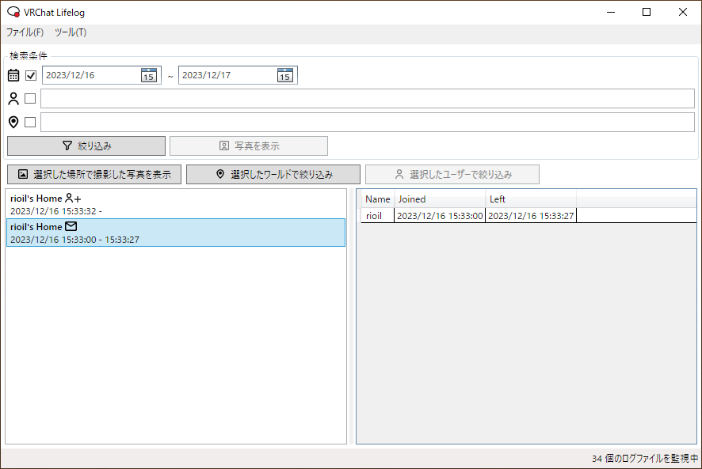
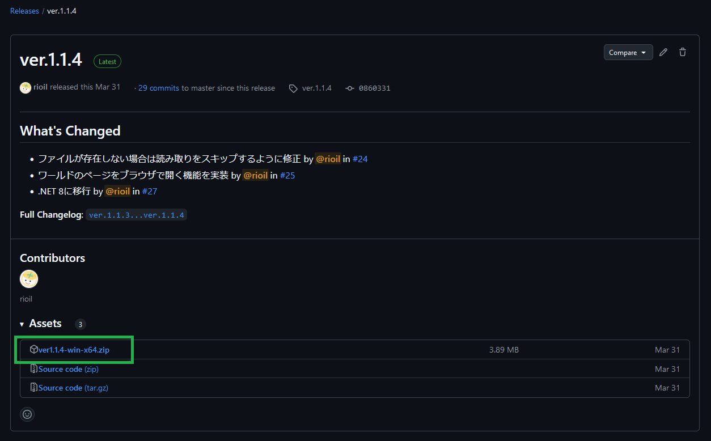

# VRChatLifelog

VRChat のログを解析して、過去に訪問したワールドや交流したプレイヤーを記録するツール

## 機能

- 訪問したワールドや同じインスタンスに滞在したプレイヤーを記録します
  - VRChat のログの解析は、このツールを起動しているときに行います
  - バックグラウンドでツールを起動し続けることで、リアルタイムにログを解析できます
- 記録したデータを画面上で確認できます
  - 期間、ワールド名、プレイヤー名で絞り込みができます
  - 条件に一致する場所で撮影されたスクリーンショットの一覧を表示できます

## 使い方

### 1. [リリースページ](https://github.com/rioil/VRChatLifelog/releases/latest)から最新バージョンの zip ファイルをダウンロードする

### 2. zip ファイルを解凍し、「VRChatLifelog.exe」を実行する

- 解凍したファイルはどこに配置しても問題ありません
- ツールはバックグラウンドで起動されます
- タスクトレイにあるアイコンをクリックすることで、画面を表示できます

### 3.（オプション）Windows起動時にツールが自動実行されるように設定する

1. 画面上部にある「ツール(T)」から「オプション(O)」をクリックすると、設定画面が表示されます
1. 「Windows起動時に自動起動する」にチェックを入れて、「OK」ボタンを押すと、Windows起動時にツールが自動実行されるようになります

> [!WARNING]
> この設定を行った後に、1.で解凍したファイルの場所を移動すると設定が無効になるため、同じ手順で再設定してください

### 4.（オプション）ツールを終了する

ツールを終了したい時は、タスクトレイにあるアイコンの右クリックメニューから「Exit」を選択してください

> [!NOTE]
> 画面右上のxボタンをクリックしても、画面が非表示になるだけでツールは終了しません

## その他

- 各機能の実装の概要については、[このページ](/doc/implementation.md)を参照してください
